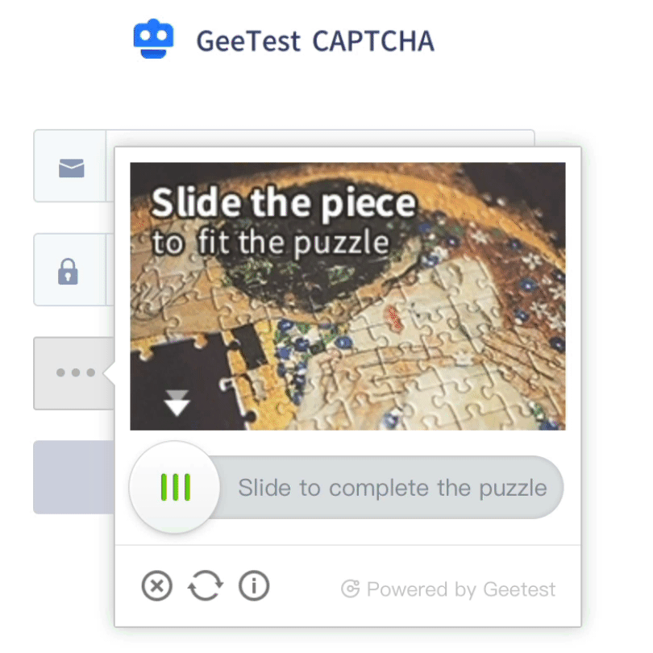

# GeeTest Slide CAPTCHA Cracker

## Hurdles

There are 2 kinds of hurdles in this slide CAPTCHA.

1. Mouse radar
2. Slide puzzle

You need to move physical mouse cursor around buttons on browser screen, because GeeTest CAPTCHA tracks your mouse movement. So I used `pyautogui` to make it through.
Also movement should be like human, so I used `pyautogui.easeInOutElastic` or `pyautogui.easeInOutSine` tweening functions not linear one.
Slide the button back and forth to look like more human.

* This code is tested on [GeeTest official demo website](https://www.geetest.com/en/demo)

## Dependency

- Python 3
- Selenium
- Pillow
- pyautogui
